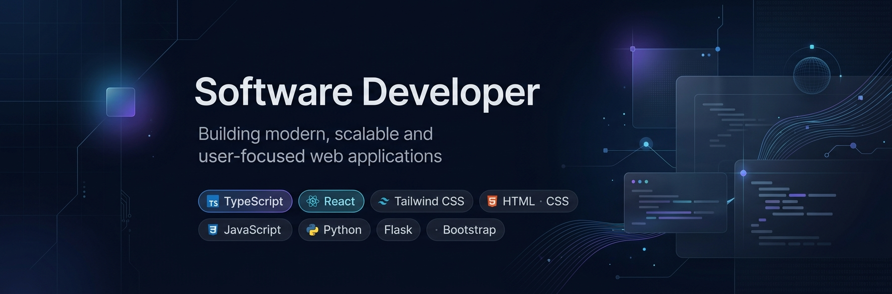

<!-- ================== PROFILE HEADER ================== -->
<p align="center">
  
</p>

<h1 align="center">Rakib Hossen</h1>

<p align="center">
  
</p>

<p align="center">
  Software Developer and Computer Science student, focused on backend engineering, web systems, APIs, and building practical software applications.
</p>

<p align="center">
  <a href="https://rakibhossendev.netlify.app" target="_blank">Portfolio</a> ·
  <a href="mailto:rakibhossendev.com@gmail.com">Email</a> ·
  <a href="https://wa.me/8801828315879" target="_blank">WhatsApp</a> ·
  <a href="https://www.linkedin.com/in/rakibhossendev" target="_blank">LinkedIn</a> ·
  <a href="https://www.facebook.com/rakibhossendev" target="_blank">Facebook</a>
</p>

<p align="center">
  
  
</p>

<hr/>

<!-- ================== ABOUT ================== -->
<h2 align="center">About Me</h2>

```javascript
const aboutMe = {
    fullName: "Rakib Hossen",
    department: "Computer Science",
    institute: "Jashore Govt. Polytechnic Institute",
    language: ["JavaScript","TypeScript","Python","C","HTML","MySQL","Sqlite3"],
    frameworksAndLibraries: ["React","Tailwind","Bootstrap","Flask"]
}
```
<hr/>

<!-- ================== TECHNICAL SKILLS ================== -->
<h2 align="center">Technical Skills</h2>

<h3 align="center">Languages</h3>

<p align="center">
  
</p>

<h3 align="center">Frameworks & Libraries</h3>

<p align="center">
  
</p>

<h3 align="center">Tools & Technologies</h3>

<p align="center">
  
</p>

<h3 align="center">Core Areas</h3>

<p align="center">
  Backend Development · REST APIs · CRUD · Authentication · Database Integration · Web Applications · Application Logic · Full-Stack Development
</p>

<hr/>


<!-- ================== GITHUB STATISTICS ================== -->
<h2 align="center">GitHub Contributions & Statistics</h2>

<p align="center">
  
</p>

<p align="center">
  
</p>
<hr/>


<!-- ================== DEVELOPER MODE ================== -->
<h2 align="center">Developer Mode</h2>

<p align="center">
  
</p>

<p align="center">
  
</p>

<hr/>

<!-- ================== FEATURED PROJECTS ================== -->
<h2 align="center">Featured Projects</h2>

<table align="center">
  <tr>
    <th>Project</th>
    <th>Description</th>
    <th>Live</th>
  </tr>
  <tr>
    <td><b>Result Management System</b></td>
    <td>A role-based academic management system for managing students, results, attendance, CGPA data, and academic workflows.</td>
    <td align="center">
      <a href="https://polytechnic-result-management-system.onrender.com" target="_blank">View</a>
    </td>
  </tr>
  <tr>
    <td><b>Attendance Management System</b></td>
    <td>A web-based attendance management application built with Flask for managing student attendance and academic records.</td>
    <td align="center">
      <a href="https://smartattendencesystemrakib.netlify.app" target="_blank">View</a>
    </td>
  </tr>
  <tr>
    <td><b>Cricket Match Control System</b></td>
    <td>A responsive web application for controlling cricket matches, scoring, and match-related data.</td>
    <td align="center">
      <a href="https://cricketematchcontrol.netlify.app/" target="_blank">View</a>
    </td>
  </tr>
  <tr>
    <td><b>AlfiC E-commerce</b></td>
    <td>A full-stack e-commerce application developed for a cake business, including product and order management workflows.</td>
    <td align="center">
      <a href="https://alfic.onrender.com" target="_blank">View</a>
    </td>
  </tr>
  <tr>
    <td><b>Blog Posting Platform</b></td>
    <td>A web platform where users can create, publish, and read articles through a structured web application.</td>
    <td align="center">
      <a href="https://rootcore6.onrender.com" target="_blank">View</a>
    </td>
  </tr>
  <tr>
    <td><b>Personal Portfolio</b></td>
    <td>A personal developer portfolio showcasing projects, technical skills, and development experience.</td>
    <td align="center">
      <a href="https://rakibhossendev.netlify.app/" target="_blank">View</a>
    </td>
  </tr>
</table>

<hr/>

<!-- ================== ENGINEERING INTERESTS ================== -->
<h2 align="center">Engineering Interests</h2>

<p align="center">
  Backend Engineering · REST API Development · Authentication · Database Systems · Software Architecture · Full-Stack Applications · Problem Solving · System Design
</p>

<hr/>

<!-- ================== STARTUP ================== -->
<h2 align="center">Startup & Team</h2>

<p align="center">
  
</p>

<h3 align="center">RooTcore6</h3>

<p align="center">
  Student-led software initiative
</p>

<p align="center">
  RooTcore6 is a student-led software initiative founded by six students. We are currently focused on learning, building real-world projects, improving our technical skills, and developing stronger teamwork and problem-solving abilities.
</p>

<p align="center">
  Our approach is simple: learn continuously, build consistently, and gradually move toward professional software development.
</p>

<hr/>

<!-- ================== CONTACT ================== -->
<h2 align="center">Let's Connect</h2>

<p align="center">
  <a href="mailto:rakibhossendev.com@gmail.com">
    
  </a>
</p>

<p align="center">
  <a href="https://wa.me/8801828315879" target="_blank">
    
  </a>
</p>

<p align="center">
  <a href="https://rakibhossendev.netlify.app" target="_blank">
    
  </a>
</p>

<p align="center">
  <a href="https://www.linkedin.com/in/rakibhossendev" target="_blank">
    
  </a>
</p>

<p align="center">
  <a href="https://www.facebook.com/rakibhossendev" target="_blank">
    
  </a>
</p>

<hr/>

<p align="center">
  <sub>Rakib Hossen · Software Developer · Python · Flask · TypeScript · React</sub>
</p>
